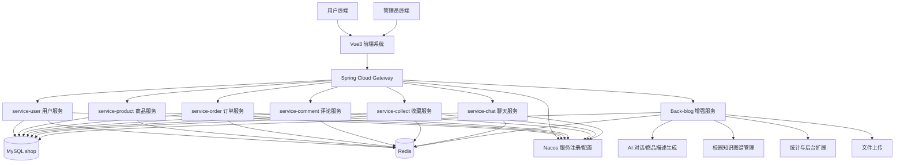
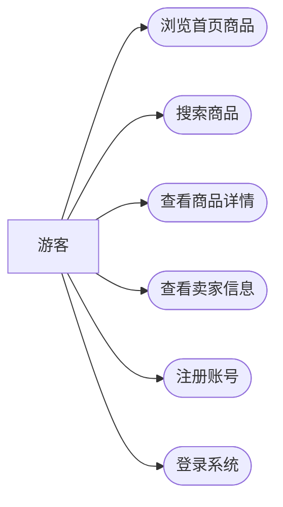
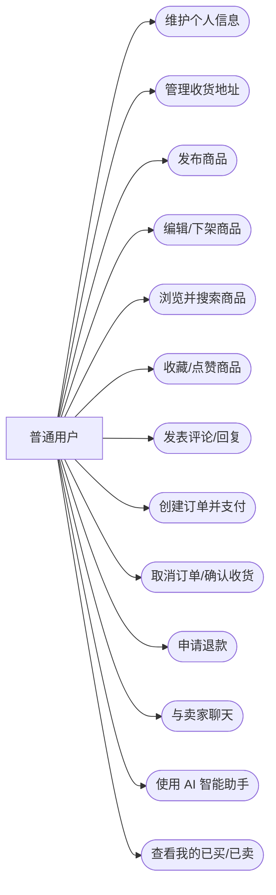
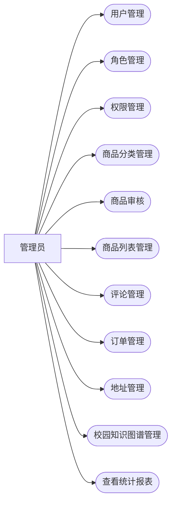
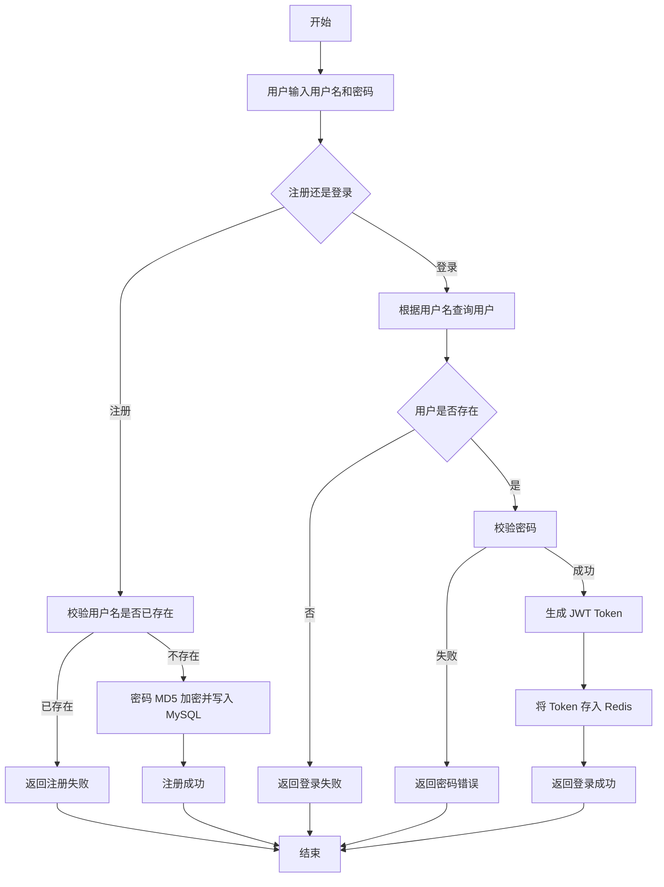
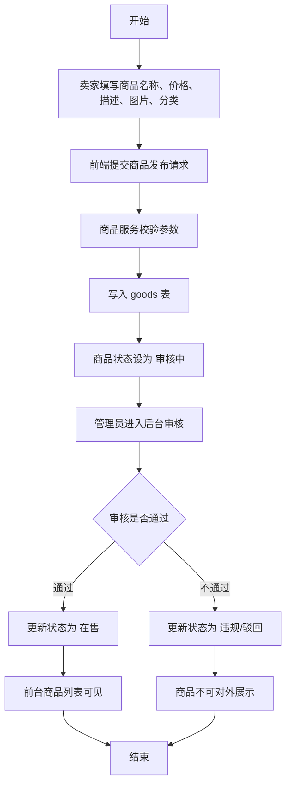
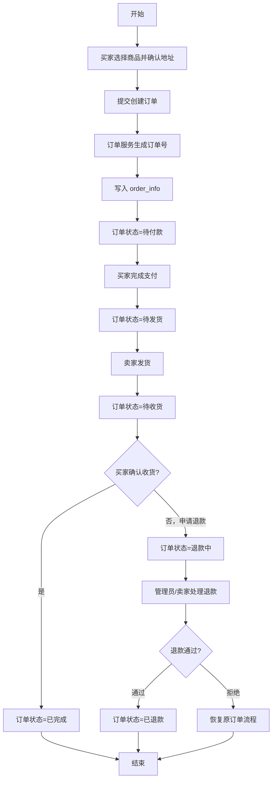
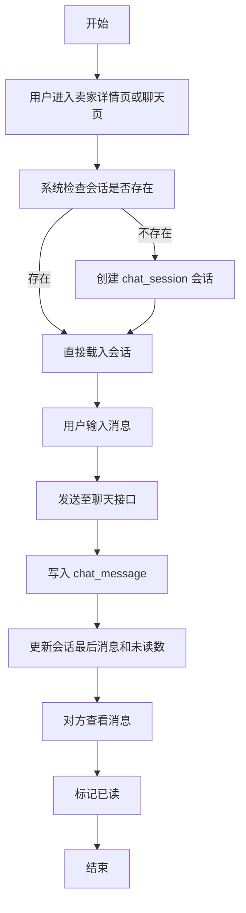
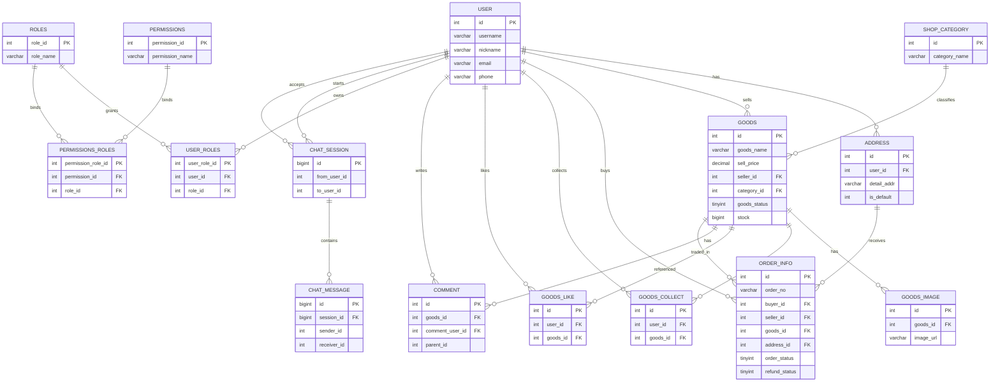

# 校园二手交易平台系统设计说明

## 1. 项目概述

### 1.1 项目名称
校园二手交易平台（校易通）

### 1.2 项目背景
本项目面向高校学生的二手交易场景，提供商品发布、商品浏览、下单购买、订单管理、收藏评论、在线沟通、后台审核与权限管理等能力。项目采用前后端分离开发方式，前端基于 Vue3 + Vite，后端同时保留了单体版 `Back-blog` 与微服务拆分版 `微服务cloud-demo二手交易平台后端`，便于课程设计中展示从单体到微服务的演进思路。

### 1.3 建设目标
1. 为普通用户提供便捷、安全的校园二手交易流程。
2. 为管理员提供商品审核、用户管理、分类管理、评论管理、权限管理与数据统计能力。
3. 通过网关、服务拆分、缓存、权限控制等技术提升系统可维护性与扩展性。
4. 结合 AI 对话与商品描述生成能力，增强平台智能化体验。

### 1.4 实际项目结构
1. 前端：`Front-blog`
2. 单体后端：`Back-blog`
3. 微服务后端：`微服务cloud-demo二手交易平台后端`
4. 数据库导出文件：`项目文档/database/shop.sql`

## 2. 系统总体设计

### 2.1 总体架构说明
系统采用前后端分离架构。前端负责页面展示、路由跳转、表单交互与图表渲染；后端负责认证鉴权、业务处理、数据持久化与服务编排。微服务版本通过 Gateway 统一路由，将用户、商品、订单、评论、收藏、聊天等能力拆分为独立服务；AI、图片上传、知识图谱等增强能力目前仍可通过 `Back-blog` 统一承载。

### 2.2 功能模块划分

| 模块 | 主要功能 |
| --- | --- |
| 用户与认证模块 | 注册、登录、个人信息维护、头像修改、密码修改 |
| 商品管理模块 | 商品发布、编辑、上下架、详情查看、我的商品、卖家商品查看 |
| 商品分类模块 | 分类新增、修改、删除、列表查询 |
| 订单交易模块 | 创建订单、支付确认、取消订单、发货、收货、退款申请、退款处理 |
| 地址管理模块 | 地址新增、修改、删除、默认地址设置 |
| 收藏与点赞模块 | 收藏商品、取消收藏、我的收藏、商品点赞、评论点赞 |
| 评论互动模块 | 商品评论、回复评论、评论管理 |
| 即时聊天模块 | 会话创建、消息发送、历史消息查询、已读标记 |
| AI 智能模块 | AI 对话、商品描述生成、校园知识辅助 |
| 后台管理模块 | 用户管理、角色管理、权限管理、商品审核、评论管理 |
| 数据统计模块 | 用户数量统计、商品数量统计、分类占比统计 |
| 网关与治理模块 | 统一路由、服务发现、熔断限流、负载均衡 |

### 2.3 功能架构图

## 3. 角色用例图

### 3.1 游客用例图

### 3.2 普通用户用例图

### 3.3 管理员用例图

## 4. 主要功能模块流程图

### 4.1 用户注册登录流程

### 4.2 商品发布与审核流程

### 4.3 订单交易流程

### 4.4 在线聊天流程

## 5. 数据库设计

### 5.1 数据库文件说明
本项目数据库采用 MySQL，数据库名为 `shop`。提交文档时可直接附上以下 SQL 文件：

1. `项目文档/database/shop.sql`

该文件来源于项目中的实际数据库导出，包含建表语句与测试数据。

### 5.2 核心数据表说明

| 数据表 | 作用 |
| --- | --- |
| `user` | 存储用户账号、昵称、邮箱、头像、手机号等信息 |
| `roles` | 存储角色信息，如管理员、用户、游客 |
| `permissions` | 存储接口级权限资源 |
| `user_roles` | 用户与角色关联表 |
| `permissions_roles` | 角色与权限关联表 |
| `shop_category` | 商品分类表 |
| `goods` | 商品主表 |
| `goods_image` | 商品图片表 |
| `goods_collect` | 商品收藏表 |
| `goods_like` | 商品点赞表 |
| `comment` | 商品评论表，支持父子评论 |
| `comment_likes` | 评论点赞记录表 |
| `address` | 用户收货地址表 |
| `order_info` | 订单主表 |
| `chat_session` | 聊天会话表 |
| `chat_message` | 聊天消息表 |

### 5.3 数据库 ER 图

### 5.4 关键关系说明
1. 一个用户可以发布多个商品，也可以购买多个商品。
2. 一个商品属于一个分类，但一个分类下可包含多个商品。
3. 一个商品可以对应多张图片、多条评论、多条收藏记录和点赞记录。
4. 一个订单同时关联买家、卖家、商品和收货地址。
5. 用户、角色、权限之间采用 RBAC 多对多关系建模。
6. 聊天模块采用“会话表 + 消息表”设计，便于实现历史记录与未读统计。

## 6. 各功能模块技术点说明

### 6.1 前端技术点

| 技术 | 实际用途 |
| --- | --- |
| Vue3 | 构建单页应用，负责组件化开发 |
| Vue Router | 路由管理，区分前台、后台、个人中心页面 |
| Pinia | 存储 Token、加载状态等全局状态 |
| Axios / Fetch | 调用后端 REST 接口与 AI 流式接口 |
| Element Plus | 后台管理与表单界面组件库 |
| ECharts | 统计页面中的图表可视化 |
| Markdown-it + highlight.js | AI 对话结果的 Markdown 渲染与代码高亮 |
| Vite | 前端开发与构建工具 |

### 6.2 后端总体技术点

| 技术 | 实际用途 |
| --- | --- |
| Spring Boot 3 | 后端服务快速开发 |
| Spring Cloud Gateway | API 网关与统一路由转发 |
| Nacos | 服务注册发现与配置中心 |
| OpenFeign | 微服务之间的远程调用 |
| Sentinel | 接口限流、熔断与降级 |
| MyBatis / MyBatis-Plus | 数据访问与 SQL 映射 |
| PageHelper | 分页查询 |
| MySQL | 业务数据持久化 |
| Redis | Token 缓存、热点数据缓存、分布式锁 |
| JWT | 登录令牌与用户身份认证 |
| WebSocket | 即时聊天通信 |
| Spring AOP | 权限注解拦截与统一处理 |
| Spring Validation | 参数校验 |
| SpringDoc / Swagger | 接口文档生成 |

### 6.3 用户与认证模块
1. 使用 `UserController` 实现注册、登录、个人信息查询、头像更新、密码修改。
2. 使用 `JWT + Redis` 管理登录态，登录成功后生成 Token 并缓存到 Redis。
3. 使用 `MD5` 对密码进行摘要处理。
4. 使用 `LoginInterceptor` 或统一拦截器校验用户身份。
5. 使用 `@Validated` 与正则表达式完成参数合法性校验。

### 6.4 RBAC 权限管理模块
1. 数据库使用 `user`、`roles`、`permissions`、`user_roles`、`permissions_roles` 构建 RBAC 模型。
2. 单体版通过 `@PreAuthorize` 自定义注解配合 AOP 做接口权限校验。
3. 前端提供用户管理、角色管理、权限管理、用户授权、角色授权等页面。
4. 适合实现管理员与普通用户的菜单与接口隔离。

### 6.5 商品与分类管理模块
1. `service-product` 负责商品新增、分页查询、详情、修改、删除、状态更新。
2. 商品状态通过枚举进行统一管理，包括在售、已售、下架、审核中、违规封禁。
3. 商品分类由 `shop_category` 表维护，支持后台分类 CRUD。
4. 商品查询使用 `PageHelper` 做分页处理，提升后台列表与前台搜索的可用性。
5. 商品详情页支持卖家信息联查、图片展示和商品追踪展示。

### 6.6 订单交易模块
1. `service-order` 提供创建订单、订单列表、详情、取消、发货、确认收货、退款申请、退款处理等接口。
2. `order_info` 表保存订单快照字段，如商品名称、价格、图片，减少历史数据受商品修改影响。
3. 使用订单状态枚举与退款状态枚举保证状态流转清晰。
4. 结合 Redis 分布式锁可避免高并发下重复下单、重复修改状态。
5. 微服务中订单服务可通过 Feign 调用商品、用户、地址等服务完成业务闭环。

### 6.7 地址管理模块
1. 地址模块负责新增、修改、删除、查询、默认地址设置。
2. 使用 `address` 表存储省市区、详细地址、邮编、默认标志等信息。
3. 下单时通过地址 ID 与订单表关联，实现订单收货信息管理。

### 6.8 评论与互动模块
1. `service-comment` 负责评论新增、列表查询、评论修改与删除。
2. `comment` 表通过 `parent_id` 支持评论回复结构。
3. `comment_likes` 表支持评论点赞记录。
4. 前端商品详情页加载评论列表，后台支持评论管理。

### 6.9 收藏与点赞模块
1. `service-collect` 负责商品收藏、取消收藏和我的收藏分页。
2. `goods_collect` 表对 `user_id + goods_id` 做唯一约束，避免重复收藏。
3. `goods_like` 表实现商品点赞能力，适合扩展人气排序、推荐逻辑。

### 6.10 在线聊天模块
1. 聊天模块使用 `chat_session` + `chat_message` 两张表保存会话和消息。
2. 单体版 `ChatController` 支持聊天列表、历史消息、发送消息、已读标记、创建会话。
3. 后端引入 `spring-boot-starter-websocket`，可以为实时消息推送提供支持。
4. 通过未读计数、最后消息、最后消息时间等字段优化聊天列表展示。

### 6.11 AI 智能助手模块
1. 前端 `HomesAIChat.vue` 通过 `fetch` 调用流式接口，并使用 `Markdown-it + highlight.js` 渲染 AI 回答。
2. 后端 `AIController` 提供 `/ai/chat` 流式对话接口与 `/ai/generateGoodsDesc` 商品描述生成接口。
3. 后端依赖 `openai-java`、`dashscope-sdk-java`、`reactor-core`，支持流式输出。
4. 结合商品名称、关键词、新旧程度、售价，可自动生成规范化商品描述，提高发布效率。
5. 项目还引入了 Milvus 相关工具类，为后续向量检索、知识增强问答预留了扩展空间。

### 6.12 数据统计模块
1. 后台统计页使用 ECharts 展示用户数、商品数以及分类商品占比。
2. 后端通过 `DashboardController` / `DashboardService` 聚合统计数据。
3. 饼图、卡片统计等方式增强了管理员对系统运行情况的感知。

### 6.13 文件上传与图片处理模块
1. 单体版后端提供文件上传接口，支持商品图片、头像等资源上传。
2. 使用 `Thumbnailator` 进行图片压缩处理，减少存储与传输开销。
3. 配置中包含第三方图床接口信息，可将图片上传到外部图床。

### 6.14 网关与微服务治理模块
1. 网关统一暴露 `/api/order/**`、`/api/product/**`、`/api/user/**`、`/api/comment/**`、`/api/goodsCollect/**`、`/api/chat/**` 等访问入口。
2. 通过 `RewritePath` 将外部请求映射到内部服务。
3. 使用 `Nacos` 进行服务注册发现，便于各微服务动态寻址。
4. 使用 `SentinelResource` 对登录、商品列表、下单、评论、收藏等热点接口进行限流保护。
5. 通过 `OpenFeign + LoadBalancer` 实现跨服务调用与负载均衡。

## 7. 环境与部署说明

### 7.1 开发环境
1. JDK 17
2. Node.js
3. Maven 3.9+
4. MySQL 8.0
5. Redis
6. Nacos

### 7.2 启动说明
1. 导入数据库：执行 `项目文档/database/shop.sql`
2. 启动 Redis、MySQL、Nacos
3. 启动 Gateway 与各微服务
4. 启动前端 `Front-blog`
5. 通过浏览器访问前台与后台页面

## 8. 总结
本项目围绕校园二手交易场景完成了用户、商品、订单、评论、收藏、聊天、权限、统计、AI 助手等核心模块设计。系统既能展示传统前后端分离项目的完整业务流程，也能体现网关、服务拆分、缓存、RBAC、限流熔断与智能化能力，符合软件架构课程大作业对“总体设计、功能流程、数据库设计、技术点说明”的要求。
